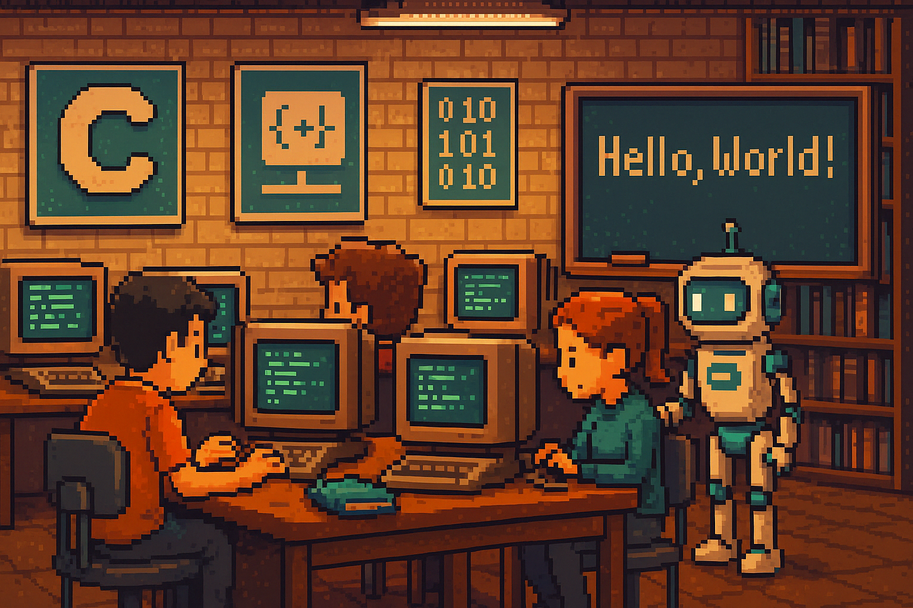

# 💻 Linguagem C — Algoritmos & Programação I





> Um repositório educacional com uma abordagem moderna, criativa e não tradicional para ensinar **lógica de programação e linguagem C**.  
> Ideal para estudantes da disciplina **Algoritmos e Programação I**.

---

## 📚 Sumário

- [🎯 Objetivo](#-objetivo)
- [📘 O que você vai aprender](#-o-que-você-vai-aprender)
- [🚀 Por que a linguagem C](#-por-que-a-linguagem-c)
- [👩‍🎓 Para quem foi feito](#-para-quem-foi-feito)
- [🗂 Organização do repositório](#-organização-do-repositório)
- [🧠 Aprenda com exemplos visuais](#-aprenda-com-exemplos-visuais)
- [📺 Vídeo aulas](#-vídeo-aulas)
- [🔗 Recursos úteis sobre C](#-recursos-úteis-sobre-c)
- [📄 Licença](#-licença)
- [🙌 Quer contribuir?](#-quer-contribuir)

---

## 🎯 Objetivo

Criar um acervo de materiais didáticos e interativos que explore os fundamentos da lógica computacional com **exemplos em linguagem C**, pensado especialmente para discentes de cursos de graduação.

---

## 📘 O que você vai aprender

| Conceito                     | Descrição                                                                 |
|-----------------------------|---------------------------------------------------------------------------|
| ✅ Variáveis                 | Armazenam valores para uso posterior                                      |
| ✅ Constantes                | Valores fixos no tempo de execução                                        |
| ✅ Estruturas de Decisão     | `if`, `else`, `switch` para controle do fluxo                            |
| ✅ Laços de Repetição        | `while`, `for`, `do...while` para repetir tarefas                        |
| ✅ Operadores                | Aritméticos, relacionais e lógicos                                       |
| ✅ Entrada/Saída             | Uso de `scanf`, `printf` e outras funções da stdio.h                     |
| ✅ Algoritmos Básicos        | Lógica de ordenação, contagem, comparação e cálculo                      |
| ✅ Organização do Código     | Comentários, indentação, boas práticas                                   |

---

## 🚀 Por que a linguagem C?

Porque ela é a **base da programação moderna**! Aprender C ajuda a compreender o funcionamento real de computadores, e prepara o caminho para outras linguagens como Python, Java, Go, Rust e C++.

---

## 👩‍🎓 Para quem foi feito?

Para você, estudante da disciplina **Algoritmos e Programação I**, que busca entender de forma leve e prática como a programação funciona “por dentro”.

---

## 🗂 Organização do repositório

```bash
├── exemplos/               # Códigos comentados por temas
├── desafios/               # Problemas para testar seus conhecimentos
├── imagens/                # Artes, gráficos, prints
├── docs/                   # Material teórico em Markdown
├── LICENSE                 # Licença MIT
└── README.md               # Essa página aqui ✨
```
# Linguagem C

🧠 **Aprenda com exemplos visuais, desafios criativos e comentários no código!**
Explore, edite, quebre e conserte os códigos. O aprendizado vem da prática, da tentativa e erro e da colaboração.

## 📺 Vídeo aulas
- [Linguagem C - Começando do absoluto zero - gratuito (2022)](https://www.youtube.com/watch?v=2w8GYzBjNj8&list=PLpaKFn4Q4GMOBAeqC1S5_Fna_Y5XaOQS2) *(abra em nova aba)*
- [Linguagem C - Gustavo Guanabara](https://www.youtube.com/watch?v=8mei6uVttho&list=PL21rh82DRnmobAWFir6DxPuTOa82myc8_) *(abra em nova aba)*
- [Curso linguagem c](https://www.youtube.com/watch?v=cZRuFwzjJ8E&list=PLucm8g_ezqNqzH7SM0XNjsp25AP0MN82R) *(abra em nova aba)*

Substitua os links acima pelos seus vídeos ou playlists favoritas!

## 🔗 Recursos úteis sobre C
- [Linguagem C do Zero ao absoluto](https://www.programiz.com/c-programming) *(abra em nova aba)*
- [Guia C para iniciantes (em PT-BR)](https://www.tutorialspoint.com/cprogramming/index.htm) *(abra em nova aba)*
- [Linguagem C guia completo](https://embarcados.com.br/linguagem-c-guia-completo/) *(abra em nova aba)*


## 📄 Licença
Este repositório está sob a Licença MIT.

De forma resumida, a licença MIT permite que qualquer pessoa:

✅ Use  
✅ Copie  
✅ Modifique  
✅ Distribua  
✅ Venda (inclusive como parte de um software comercial)

...com uma única condição:  
🔸 Manter o aviso de copyright e a licença original no código-fonte.

Leia o arquivo `LICENSE` para mais detalhes.

## 🙌 Quer contribuir?
Fique à vontade para abrir issues, pull requests ou sugestões! Este projeto é aberto para a comunidade aprender e crescer junta.
